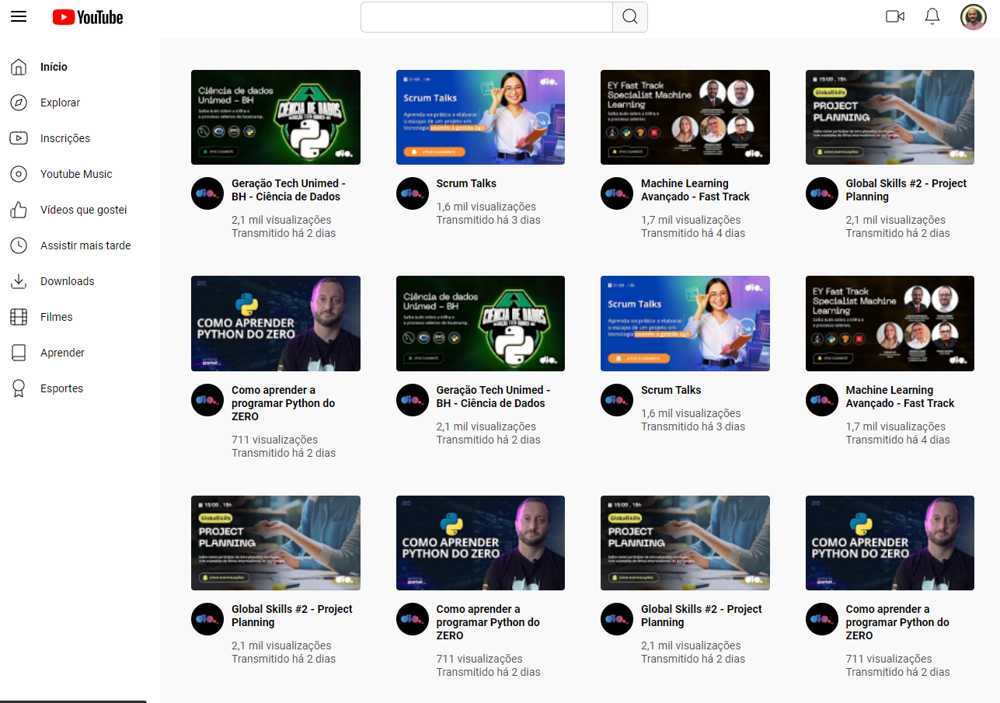

# Desafio de Clone da Página Inicial do YouTube

Este é o repositório do desafio de clone da página inicial do YouTube, proposto no módulo de Grid Layout da formação de CSS da DIO.me. O objetivo deste desafio é aplicar e fixar os conceitos de Grid Layout, reproduzindo a aparência visual da página inicial do YouTube.

## Conceitos Utilizados

Durante a realização deste desafio, foram aplicados os seguintes conceitos de Grid Layout:

- `grid-template-columns`
- `grid-template-rows`
- Posicionamento de grid
- Grid lines
- Gap (espaçamentos entre células)

## Considerações Finais

Este desafio proporciona uma excelente oportunidade para aplicar e fixar os conceitos de Grid Layout, desenvolvendo habilidades práticas em CSS. 